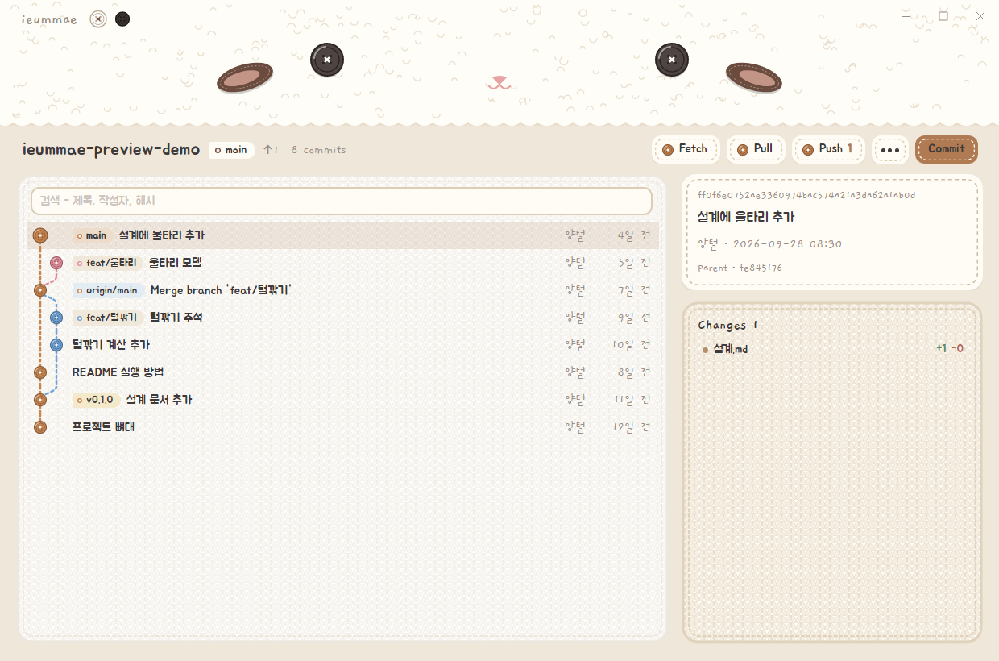
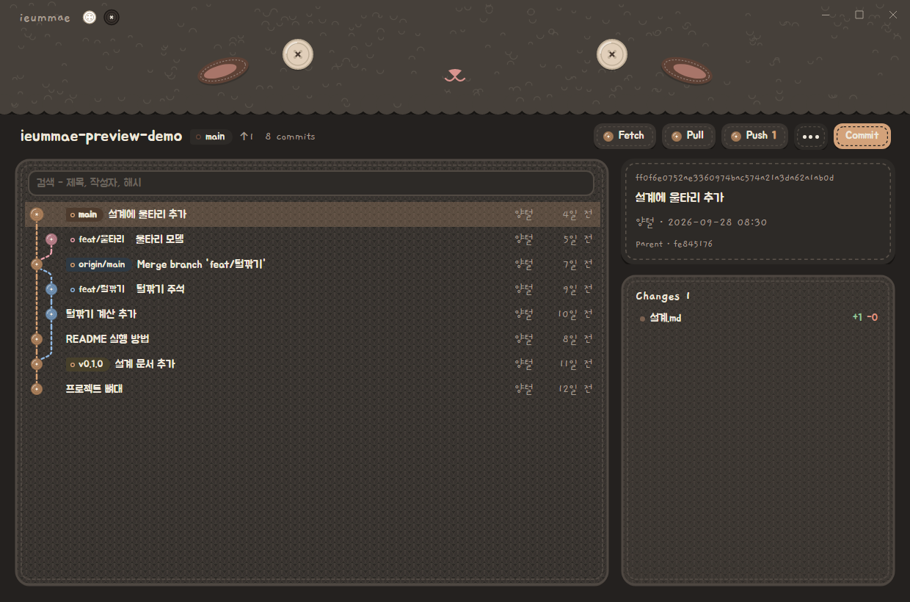

# ieummae

Windows 탐색기 우클릭에서 바로 쓰는 Git 도구.

| Light | Dark |
|---|---|
|  |  |

## 화면

| 화면 | 내용 |
|---|---|
| Log | 그래프·이름표·검색, 커밋 상세와 변경 파일, 파일·폴더 단위 로그 |
| Log 행 우클릭 | Checkout·New Branch·New Tag·Reset·Revert·Cherry-pick·Copy Hash, 두 커밋 고르면 Compare |
| Commit | 고른 파일만 커밋, diff 미리보기, Amend, 최근 메시지, Push 체크, 파일 우클릭으로 Revert·Delete(휴지통)·.gitignore |
| Diff | 통합·좌우 보기, 단어 단위 강조, 공백 무시 |
| Conflicts | 덩어리별 Ours·Theirs·Both·직접 고치기, 지운 파일 남기기·지우기, Continue·Abort·Skip |
| 기타 | Blame, Clone, Init, 설정(작성자 이름·메일, 테마, diff 보기) |
| ⋯ 메뉴 | Switch·New Branch·Delete Branch·Merge·Rebase, Stash·Stash List, Tags, Remotes, 설정 |
| 탐색기 | Win11 우클릭 메뉴 "이음매", 파일·폴더 아이콘 표시(정상·수정·충돌·추가) |

- 이동 - 다른 화면은 같은 창 안에서 열림, 양털 왼쪽 아래 뒤로 버튼 또는 Alt+←
- Fetch·Pull·Push - 누른 버튼의 박음질이 돌며 진행 표시, 다시 누르면 취소. 실패할 때만 알림
- Push 버튼 - 올릴 커밋 수 표시, 올릴 게 없으면 흐리게 (로그·커밋 화면 둘 다)
- 단축키 - F5 새로 고침, 커밋 화면 Ctrl+Enter 커밋, 대화 상자 Enter 확인·Esc 취소

## 설치

관리자 PowerShell 에서:

```powershell
./scripts/install.ps1      # 빌드 → %LOCALAPPDATA%\Programs\ieummae, 인증서·메뉴·아이콘 표시 등록, 탐색기 다시 시작
./scripts/uninstall.ps1    # 등록 해제 후 설치 폴더 삭제
```

- 우클릭 메뉴 - 자체 서명 sparse package (본인 PC 전용). 인증서 개인 키 `package/ieummae.pfx` 는 gitignore

## 명령어

```text
ieummae <명령> [경로] [--theme light|dark]

log      커밋 기록 (경로가 하위 폴더·파일이면 그 경로만)
commit   커밋 (경로가 하위 폴더면 그 아래 변경만)
diff     파일 하나의 작업 트리 변경        blame     파일 줄마다 마지막 수정 커밋
fetch · pull · push · switch · branch · merge · rebase · stash · stash-list · tags · remotes
         로그 화면을 띄우고 그 위에서 바로 실행 (탐색기 메뉴용)
conflicts  충돌 해결                       clone · init · settings  (저장소 밖에서도)
```

## 구조

| 경로 | 내용 |
|---|---|
| `src/Ieummae.Core` | git CLI 실행, diff·로그·상태·충돌 해석. UI 의존 없음 |
| `src/Ieummae.App` | 창 하나(MainWindow)와 화면들(Page) - Avalonia 12 + NativeAOT, [결정 기록](docs/STACK.md) |
| `tests/Ieummae.Core.Tests` | 임시 저장소를 실제로 만들어 git 동작 검증 |
| `shell/menu` | 우클릭 메뉴 DLL (Rust, IExplorerCommand) |
| `shell/cache` · `shell/overlay` | 아이콘 표시 - 상태 캐시 프로세스 + 탐색기 안에서 캐시만 묻는 DLL |
| `package` | sparse package 매니페스트, 인증서·패키지·아이콘 스크립트 |
| `tools/preview` | 창을 띄우지 않고 화면을 PNG 로 그려 브라우저에서 확인 (데모·충돌 데모 저장소 자동 생성) |
| `tools/bench` | 창 표시 시간·메모리 측정 |
| `design/mockup` | 디자인 시안 (참고용) |

## 라이선스

[MIT](LICENSE). 글꼴은 각 라이선스(`src/Ieummae.App/Assets/Fonts/licenses`).
